# Covid-19

 Página web con un dashboard en el que se pueda ver el número de los contagios de covid-19 hasta la fecha, así como el número de recuperados y el número de personas vacunadas.

<h2>Landing Page</h2>
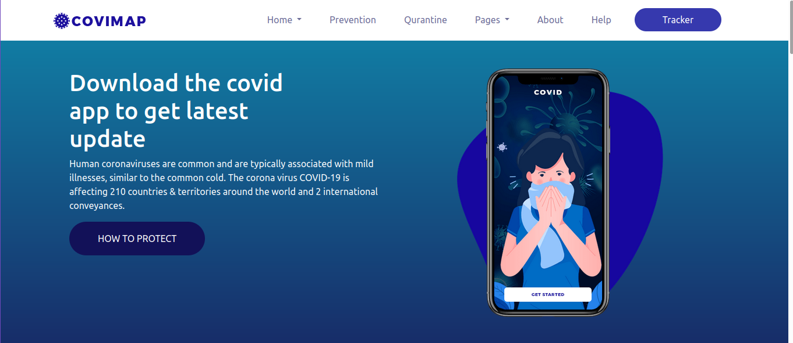
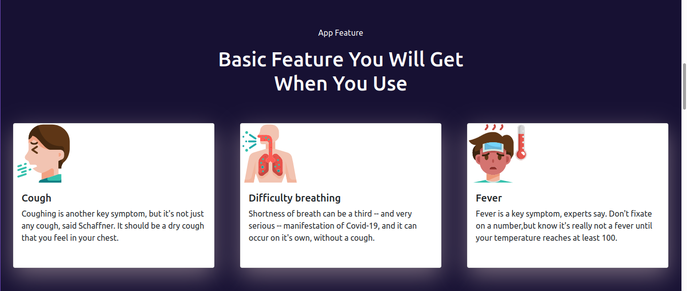
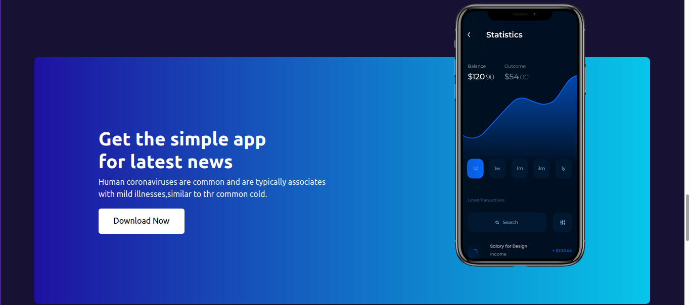
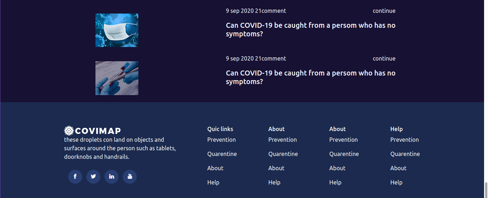

<h2>Trackers</h2>
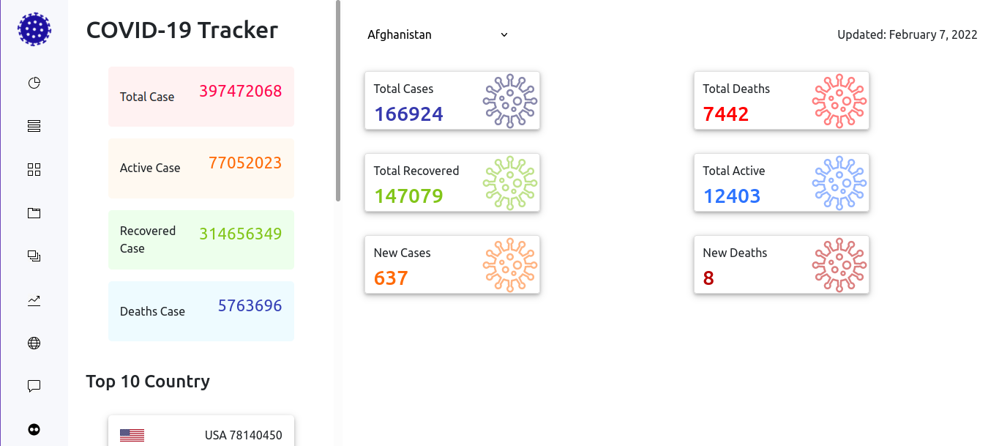
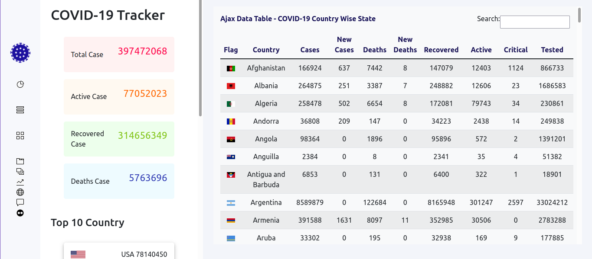
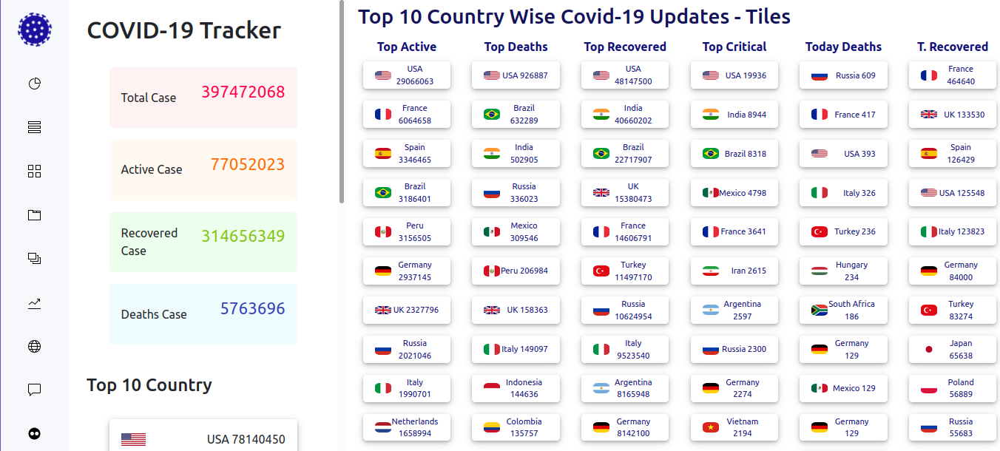
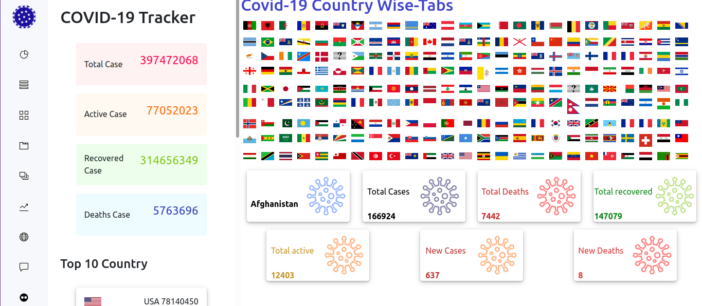
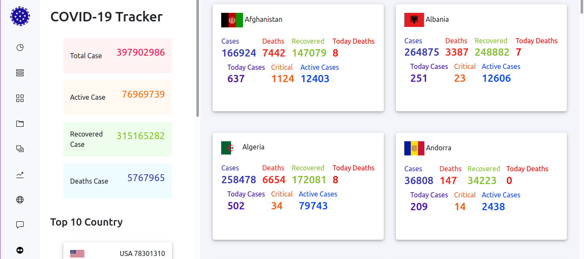
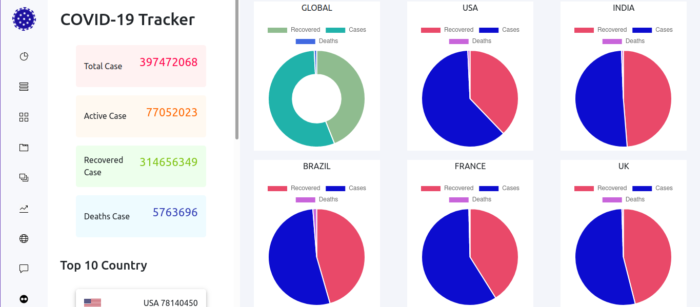
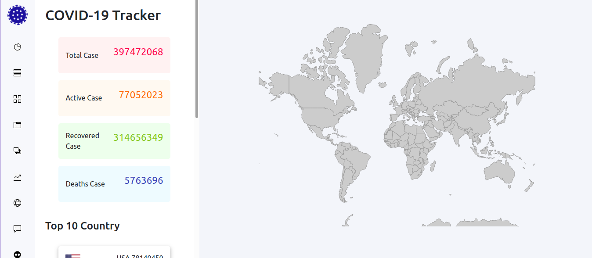

<h3>Pagina desplegada:</h3>

https://majoalba20.github.io/Covid-19/
